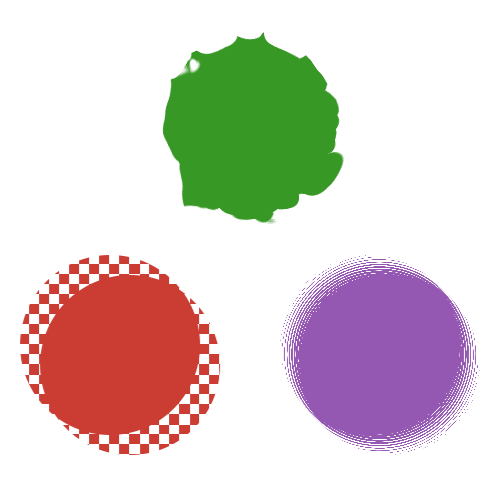

#  CoherentTransformations

Combine [CoherentNoise.jl](https://github.com/mfiano/CoherentNoise.jl) and
[ImageTransformations.jl](https://github.com/JuliaImages/ImageTransformations.jl)
to produce interesting effects on photos.
